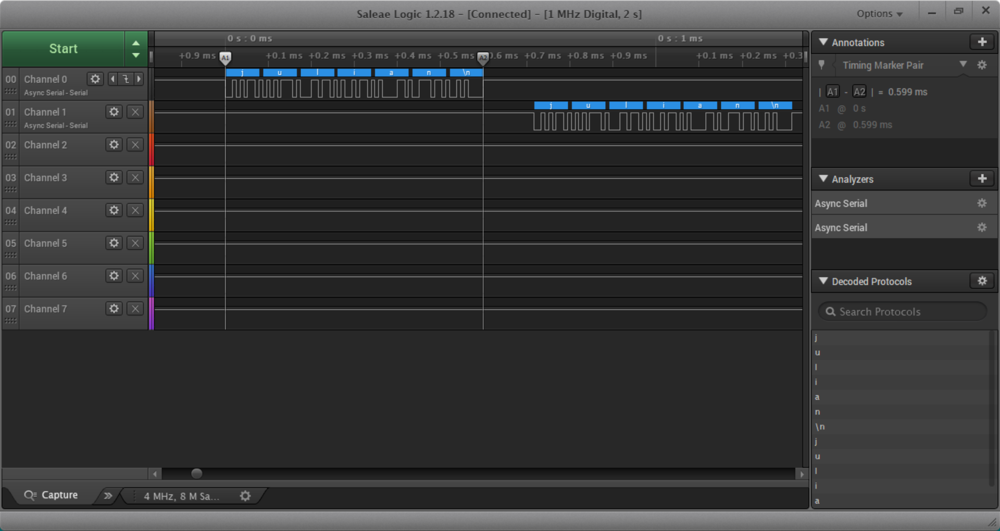

Name: Julian Wearden

EID: jfw864

Team Number: 11

## Questions

1. Why does your program need a setup and a loop?

    You need the setup so that you can define global variables and initialize input/output/other program functions, 
    and a loop to run a specified bit of code over and over again.

2. What is the downside to putting all your code in a loop?

    It's slower since it has to re-initialize more than once, and it would reset the variables every run through. 
    It would also make writing complex code far more difficult because you wouldn/t be able to call functions or 
    use methods.
    

3. Why does your code need to be compiled?

    The code is compiled to convert the C programming language to machine code that the computer can read, interpret, and 
    execute.

4. When lowering the frequency in procedure A, step 4, what is going wrong? Brainstorm some solutions. Dimmers exist in the real world. What is their solution?

    The light flickers a lot instead of it being a gradual dimming. To fix this you need to keep the frequency 
    high enough to where you don't notice the flickering or use a dimmer switch.

5. Why do you need to connect the logic analyzer ground to the ESP32 ground?

    That is the only way for the circuit to be closed. The closed circuit also allows current, and therefore 
    information, to flow through the logic analyzer.

6. What is the difference between synchronous and asynchronous communication?

    For synchronous communication, the sender and receiver must synchronize clocks before data transmission 
    occurs, and that data is then transmitted in the form of blocks or frames. Asynchronous communication doesn't
    require a clock and the data is transmitted 1 byte or character at a time. Synchronous communication is faster.

7. Profile of UART: Sent X bytes in Y time 

    Sent 6 bytes in 0.599 ms time

8. Profile of SPI: Sent X bytes in Y time

    Sent 6 bytes in 0.1785 ms time

9. Why is SPI so much faster than UART?

    SPI is synchronous, sending blocks or frames of data at a time, while UART is asynchronous, sending 1 byte at a
    time.

10. list one pro and one con of UART

    A pro of UART is that it only requires two wires and that no clock signal is necessary. A con is that the 
    asynchronous nature of UART makes it slower.

11. list one pro and one con of SPI

    A pro of SPI is that the MISO and MOSI allow data to be received and sent at the same time, thus making it
    faster. A con of SPI is that it requires 3+ wires and therefore more channel pins are used.

12. list one pro and one con of I2C

    One pro of I2C is that is flexible and supports multi master and multi slave communication. A con of I2C 
    is that it requires more space as resistors are required.

13. Why does I2C need external resistors to work?

    The external resistors of an I2C set the default state of a signal line or Input/Output pins

## Screenshots

Procedure A, step 1:

Procedure A, step 4:

Procedure B, UART:

Procedure B, SPI:

